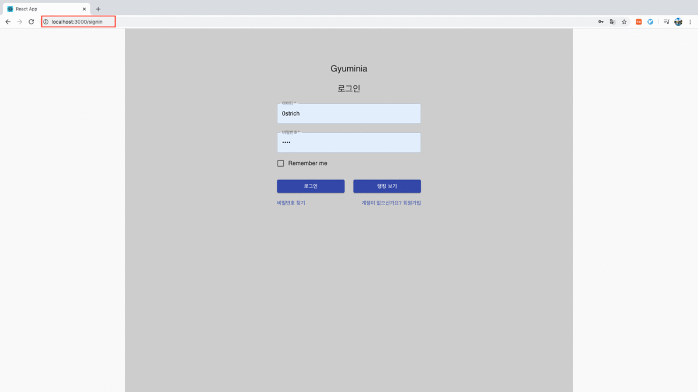

## Gyuminia Project Front-end

이 App 은 Gyuminia 게임의 프론트 부분을 다룹니다.

### Developer

김규동

### Stacks

React, Redux, Redux-thunk, React-router, axios

### Main Techs

1. react-router-dom 을 사용한 다중 페이지 구현
2. 클라이언트 jwt token 인증 구현
3. 토큰 인증이 필요한 페이지를 Custom Route(AuthRoute) 사용해 라우팅

### Multipage Routing

react-router-dom을 사용한 react 다중 페이지 라우팅 구현

#### url

#### Page

### JWT Token Auth

로그인 성공시 서버로부터 accessToken, refreshToken 발급 받아서 localStorage에 저장
인증 필요시 localStorage 에서 불러와 사용
token 인증 만료시 로그인 localStorage에 저장된 token 파기 후 로그인 페이지 라우팅 되도록 하는 AuthRoute 컴포넌트 만들어 사용
로그아웃 버튼 클릭시 localStorage에 저장된 token 파기 후 로그인 페이지 라우팅

TOKEN TIME EXPIRE

REMOVE TOKEN : TIME EXPIRE

REMOVE TOKEN : LOGOUT

### Auth Form Validation Check

로그인, 회원가입 폼 제출시 서버로부터 받은 stauts code 로 모달창 출력
로그인 : 401, 404
회원가입 : 200, 401, 404, 409

### Character Page

각 유저별 캐릭터 페이지에서 여러개의 캐릭터를 만들 수 있음
캐릭터명 중복 체크
새로운 캐릭터는 데이터베이스에서 설정한 기본값으로 셋팅

### Ranking Page

서버에 저장된 캐릭터들 score를 기준으로 내림차순해서 출력

### Play Page & Store Page

플레이 페이지 버튼 구현 및 상점 페이지 전환
